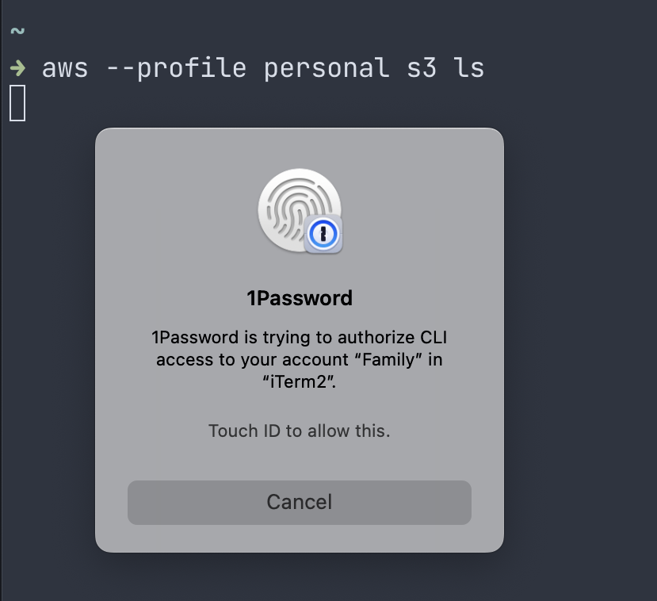

## Introduction
If you have to use AWS static credentials in place of SSO or STS then storing credentials on disk opens the risk of them being stolen or being used without your knowledge.

One solution is to store the credentials within 1Password and inject them when needed via credential helper. This gives the benifit of no credentials on disk and a biometric prompt when they are used.

While 1Password supports this natively via [CLI Plugins](https://developer.1password.com/docs/cli/shell-plugins/aws), this wraps the AWS CLI and interferes with tooling that may call the CLI directly. Your usage may vary so give it a try first.


## How To

Within your `.aws` directory create a directory called `1pw` and a json file named after the account to use (in my case `personal`):

```shell
~/.aws
├── 1pw
│   ├── personal.json
├── cli
├── config
├── credentials
└── sso
```

The JSON file should contain the location within the vault to access the access key and secret:

```json
{
   "Version": 1, 
   "AccessKeyId": "{{ op://Personal/AWS Personal/ACCESS_KEY_ID }}",
   "SecretAccessKey": "{{ op://Personal/AWS Personal/SECRET_ACCESS_KEY }}" 
}
```

Here we are saying from the 1PW vault `Personal` get item `AWS Personal` and fetch the fields `ACCESS_KEY_ID` and `SECRET_ACCESS_KEY` or as viewed in 1Password:


Within the AWS `credentials` file define the profile using a `credential_process`

```toml
[personal]
credential_process = op --cache inject --in-file ~/.aws/1pw/personal.json
region = eu-west-2
output = json
```

The profile can now be used as usual and credentials will be fetched from 1Password



```shell
➜ aws --profile personal s3 ls
2022-11-06 10:38:23 ABC
2022-11-02 16:08:05 aws-cloudtrail-logs-XXX
2022-02-20 09:43:29 DEF
```